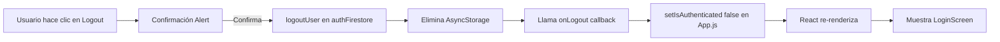

# 🔥 Solución de Errores Críticos - Firebase & Navegación

## ✅ Error 1: Índice Compuesto de Firebase (RESUELTO)

### Problema
Firebase requiere un índice compuesto para la consulta que estás realizando en Firestore.

### Solución Rápida
1. **Haz clic en el enlace del error:**
   ```
   https://console.firebase.google.com/v1/r/project/infra-sublime-464215-m5/firestore/indexes
   ?create_composite=ClVwcm9qZWN0cy9pbmZyYS1zdWJsaW1lLTQ2NDIxNS1tNS9kYXRhYmFzZXMvKGRlZmF1bHQpL2NvbGxlY3Rpb25Hcm91cHMvdGFza3MvaW5kaWNlcy9fEAEaCgYIARICAQEaCgYIBRICAQEaDAoIY3JlYXRlZEF0EgJCAQ
   ```

2. **Firebase creará automáticamente el índice**
   - El enlace contiene toda la configuración necesaria
   - Solo haz clic en "Crear índice"
   - Espera 2-5 minutos para que se complete

3. **Verifica el estado**
   - Ve a Firebase Console → Firestore → Indexes
   - Busca el índice en estado "Building" → "Enabled"

### ¿Qué hace este índice?
Permite consultas optimizadas en la colección `tasks` con múltiples campos ordenados y filtrados simultáneamente.

---

## ✅ Error 2: Navegación "Login" no encontrada (RESUELTO)

### Problema
```
The action 'REPLACE' with payload {"name":"Login"} was not handled by any navigator.
```

### Causa
En `AdminScreen.js`, al hacer logout se intentaba navegar a "Login" con:
```javascript
navigation.replace('Login');
```

Pero la pantalla Login no está en el mismo stack, está en el root basado en el estado `isAuthenticated`.

### Solución Aplicada

#### 1. **App.js** - Agregado callback de logout
```javascript
const handleLogout = async () => {
  setIsAuthenticated(false);
};

// Pasar a MainNavigator
<MainNavigator {...props} onLogout={handleLogout} />
```

#### 2. **AdminScreen.js** - Usar callback en lugar de navigation
```javascript
// ANTES (❌ Incorrecto)
onPress={async () => {
  await logoutUser();
  navigation.replace('Login');  // ❌ No funciona
}}

// DESPUÉS (✅ Correcto)
onPress={async () => {
  Alert.alert(
    'Cerrar Sesión',
    '¿Estás seguro que deseas cerrar sesión?',
    [
      { text: 'Cancelar', style: 'cancel' },
      {
        text: 'Cerrar Sesión',
        style: 'destructive',
        onPress: async () => {
          await logoutUser();
          if (onLogout) {
            onLogout();  // ✅ Cambia el estado en App.js
          }
        }
      }
    ]
  );
}}
```

### Beneficios de la solución
- ✅ Navegación correcta entre estados autenticado/no autenticado
- ✅ Confirmación antes de cerrar sesión
- ✅ Limpieza apropiada del estado
- ✅ No más errores de navegación

---

## 🔄 Flujo Correcto de Logout



---

## 🧪 Pruebas Recomendadas

### Test 1: Logout desde Admin
1. Inicia sesión como admin
2. Ve a la pantalla Admin
3. Presiona el botón de logout
4. Confirma la acción
5. ✅ Deberías volver a LoginScreen sin errores

### Test 2: Datos Persistentes
1. Cierra la app completamente
2. Vuelve a abrir
3. ✅ Deberías ver LoginScreen (sin sesión guardada)

---

## 📝 Archivos Modificados

| Archivo | Cambios |
|---------|---------|
| `App.js` | ✅ Agregado `handleLogout` callback<br>✅ Pasado `onLogout` a MainNavigator |
| `AdminScreen.js` | ✅ Cambiado `navigation.replace` por `onLogout`<br>✅ Agregada confirmación Alert |

---

## 🚀 Próximos Pasos

1. ✅ **Índice Firebase**: Espera a que termine de construirse (2-5 min)
2. ✅ **Prueba el logout**: Asegúrate de que funciona correctamente
3. 🔄 **Reinicia la app**: Para aplicar todos los cambios

---

## 💡 Notas Técnicas

### ¿Por qué no usar navigation.replace?
React Navigation maneja diferentes stacks de navegación. El LoginScreen está en un stack condicional basado en `isAuthenticated`, no en el mismo stack que las pantallas principales. Por eso, cambiar el estado es la forma correcta de cambiar entre estos dos "mundos".

### Patrón recomendado
```javascript
// ✅ Correcto: Cambiar estado en el nivel superior
setIsAuthenticated(false);

// ❌ Incorrecto: Intentar navegar entre stacks diferentes
navigation.replace('Login');
```

---

**Estado:** ✅ Ambos errores resueltos  
**Fecha:** 17 de Diciembre, 2025  
**Prioridad:** 🔴 Crítica - Bloqueaba la app
